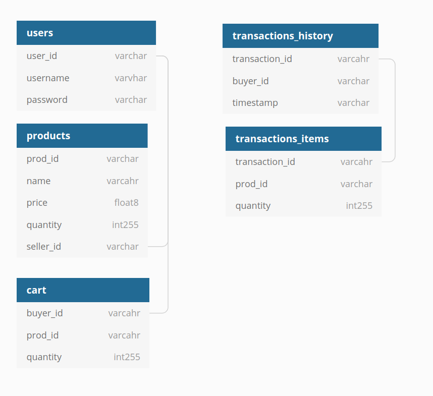

# Simple_e_commerce_project

**This project has been archived as of 27/09/2020**

This was a project I did as I learnt full-stack web development.  

This project was done with NodeJS running the backend and MySQL running the database.  
Technologies used:  

|Stack componoent|Technology|
|:---|:---|
|Front-End|HTML, CSS, JS Bootstrap-Vue, VueJS|
|Back-End|ExpressJS (running off NodeJS), express-handlebars (view engine),<br>mysql (JS lib to talk to MySQL database), passportJS (authentication)|
|Database|MySQL|

The idea of this project was to make a simple e-commerce website, like Amazon, Lazada or Taobao for example.  

## Setting up env and project  

### For ubuntu

Prerequisites:  
- NodeJS
- MySQL

Note: I recommend using MySQL workbench in conjunction with just MySQL from the terminal.

To start setting up the env, you can run these commands:
```bash
git clone https://github.com/chuanhao01/Simple_e_commerce_project.git
cd Simple_e_commerce_project
npm i
```

With this, all the required node packages will be installed.  
Then run the queries in `SQL for restful api.sql` file in SQL.

Lastly, note that you have to set up the MySQL connection, `MysqlUser` and `MysqlPassword`, and the `CookiePassword`. (Filename and code snippet are shown below).

`db/index.js`
```javascript
const db = require('mysql');
const pool = db.createConnection({
    connectionLimit: 10,
    user: process.env.MysqlUser, /*HERE*/
    password: process.env.MysqlPassword, /*HERE*/
    database: 'bed_e_commerce',
    port: 3306,
});
...
...
```

`app.js`
```javascript
...
...
app.use(session({
    secret: process.env.CookiePassword, /*HERE*/
    cookie: {
        httpOnly: true,
    },
    name: 'passport',
    resave: true,
    saveUninitialized: false,
}));
...
...
```

After this all you need to do to run the server is to type: `npm start` in the terminal.

## More details  

This should how your file directories should look like.
```bash
.
├── app.js
├── controllers
│   └── ...
├── db
│   └── ...
├── LICENSE.md
├── middlewares
│   └── ...
├── package.json
├── package-lock.json
├── read_content
├── README.md
├── SQL for restful api.sql
└── views
    ├── account
    │   └── ...
    ├── error
    │   └── ...
    ├── home
    │   └── ...
    ├── layouts
    │   └── ...
    ├── partials (empty)
    └── users
        └── ...
```

#### Breif descriptions

The `app.js` file is the main file that runs the server. In it, the file calls the other dependencies and files for the server to start.

The files in `controllers` are separated in the way below.  
The respective controllers are used as both the routing mechanism and logic control depending on the type of request received.
```bash
controllers/
├── accountController.js
├── apiController.js
├── homeController.js
├── index.js
└── usersController.js
```

The files in `db` contain the main JS logic connecting the back-end express server to the MySQL database.
Note: The main wrapper object is in `index.js`, accessed through the `dataAccess` object.
```bash
db/
├── cartDB.js
├── index.js
├── productsDB.js
├── transactionsDB.js
└── usersDB.js
```

In `index.js`

```javascript
...
...
const dataAccess = {
    products: productsDB,
    users: usersDB,
    cart: cartDB,
    transactions: transactionsDB,
};

module.exports = dataAccess;
```

The files in `middleware` contain the middleware used in the main `app.js`.  
These include the local implementation of passportJS and authenticating the request paths.  
```bash
middlewares/
├── passport.js
└── path_auth.js
```

The `views` folder contains the views that would be loaded by express-handlebars as the HTML seen by the user. In the folder, there are multiple subfolders for the respective controllers and paths.  

```bash
views/
├── account
│   ├── createAccount.hbs
│   └── loginAccount.hbs
├── error
│   └── 403.hbs
├── home
│   └── landing.hbs
├── layouts
│   └── main.hbs
├── partials
└── users
    ├── buyer
    │   ├── buyItem.hbs
    │   ├── checkout.hbs
    │   ├── getAllItems.hbs
    │   ├── viewCart.hbs
    │   └── viewItem.hbs
    ├── seller
    │   ├── addItem.hbs
    │   ├── editItem.hbs
    │   ├── getAllItems.hbs
    │   └── getItem.hbs
    ├── transactions.hbs
    └── userHome.hbs
```

### Database

Below is a diagram of the database design  


#### Brief Description


# LICENSE

This project is licensed under the MIT License - see the LICENSE.md file for details

